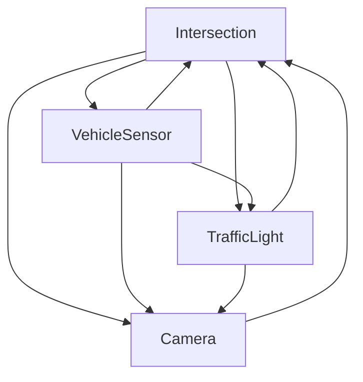

# Production Orion entity model

Production Orion stores the current NGSI-LD state consumed by Server. It is not the historical store.

## Write and read boundaries

| Operation | Allowed component |
|---|---|
| Create/update production traffic entities | Projector only |
| Read application entity state | Server |
| Display entity state | Dashboard through Server APIs |
| Historical ingestion | Not an Orion responsibility |

## Current-state semantics

- Entity IDs are the production URNs defined in [NGSI_ENTITY_CONTRACT.md](NGSI_ENTITY_CONTRACT.md).
- Production namespace does not rewrite IDs with test or shadow suffixes.
- A newer Kafka event for an entity replaces its current attributes in Orion according to Projector upsert behavior.
- `simulationRunId`, `scenarioId` and `simulationTime` identify the current simulation state exposed to Server.
- `TrafficSimulationRunStarted` is the only event allowed to activate a new run for projection.
- Server aggregate responses may compare related entities by run, scenario and simulation time before declaring them consistent.

## Entity graph

## Server-facing access

Server reads Orion through NGSI-LD APIs and exposes application endpoints such as:

- `/api/intersections`
- `/api/traffic-lights`
- `/api/vehicle-sensors`
- `/api/cameras`
- `/api/realtime/intersections/{intersectionId}`

Dashboard must consume these Server APIs instead of querying Orion directly.
