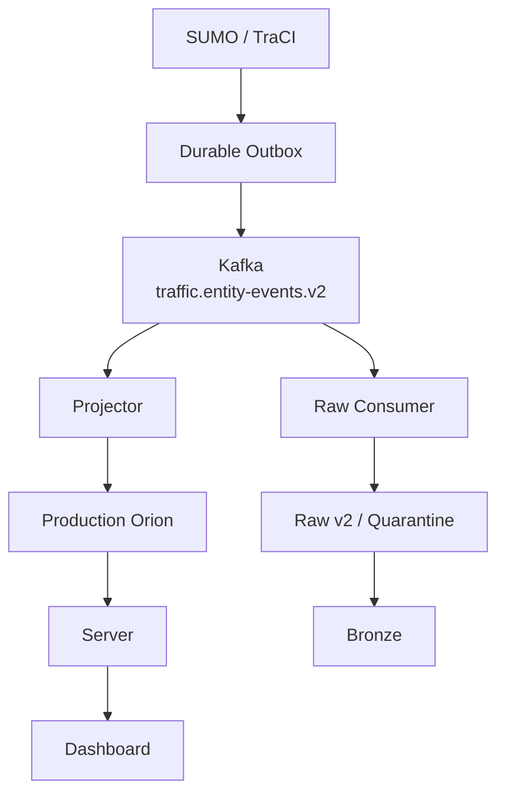

# Runtime topology

## Network boundaries

- Host producer to Kafka: `localhost:29092`.
- Container consumers to Kafka: `kafka:9092`.
- Projector to Orion: `http://orion:1026`.
- Server host process to Orion: `http://localhost:1026`.
- Dashboard to Server: Server HTTP API; exact Dashboard endpoint is owned by the Dashboard project.
- Raw Consumer and Bronze Processor use ClickHouse at `clickhouse:8123` inside Compose.

## Runtime rules

- Both Kafka branches operate independently.
- Projector owns only current-state projection.
- Raw Consumer owns only historical classification and persistence.
- Bronze never reads Kafka or Orion directly.
- Dashboard never reads Kafka, Orion or ClickHouse directly.

## Rollback Assets

Webhook, Orion subscription, Raw v1 and non-default migration configuration are outside this topology and are retained only as Rollback Assets.
